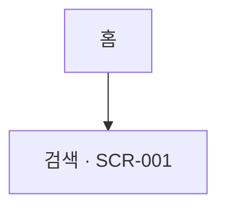

# IA — 정보구조도  [③ 가이드]

> 화면 구조·메뉴 체계의 **단일 진실**. 화면설계서의 `.ia` 페이지는 이 표를 시각화한 파생물이다.
> 표의 *기울임* 값은 예시 — 실제 내용으로 교체.
> 작성 가이드: `rules/methodology/templates.md` 의 ③ IA · 화면설계서 반영: `rules/methodology/designspec.md`

## 정보구조 (메뉴 ↔ 화면 매핑)
> '화면 ID' 는 `docs/screens/SCR-###.md` 와 **동일 ID**. 비어 있으면 화면 미정 — 마감 전 채운다.

| Depth 1 | Depth 2 | Depth 3 | 화면 ID | 설명 |
| --- | --- | --- | --- | --- |
| *홈* | *검색* | *—* | *SCR-001* | *키워드 검색 진입 화면* |
|  |  |  |  |  |

## 사이트맵 (선택 — 트리/다이어그램)
> 메뉴가 3depth를 넘거나 도메인이 여러 개면 트리 다이어그램을 함께 둔다(mermaid 권장 — Confluence 동기화 시 PNG로 자동 변환).

## 갱신 규칙
- 메뉴/화면을 추가·삭제하면 본 표를 먼저 갱신하고, 대응하는 `docs/screens/SCR-###.md` 와 ID를 맞춘다(단일 진실).
- 대규모(도메인 3개+)면 도메인별 IA 를 `docs/domains/{도메인}/` 하위로 분할 고려 — `rules/methodology/indexing.md` § 3.
